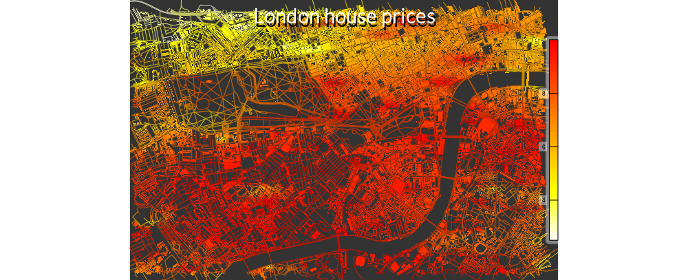

Visualisation of London housing data using `osmplotr`
========

## 1. Reading Data

Data on housing prices and transactions were taken from
[http://data.london.gov.uk/dataset/average-house-prices-borough](http://data.london.gov.uk/dataset/average-house-prices-borough),
with spatial boundaries of the 'Lower Super Output Areas' (LSOA; the finest
spatial scale) from
[http://data.london.gov.uk/dataset/statistical-gis-boundary-files-london](http://data.london.gov.uk/dataset/statistical-gis-boundary-files-london)

Because the links to these data files are likely to change, the script requires
data to be downloaded first.  Start by reading the housing price data
```{r, warning=FALSE, message=FALSE}
lf <- list.files ("./dat")
fi <- grep ("house-prices", lf)
fname <- paste0 ("./dat/", lf [fi])
housing <- readxl::read_excel (fname, sheet="LSOA11")
# Table has "." for missing values
housing [housing == "."] <- NA
names (housing)
```

Convert data columns to numeric:
```{r}
for (i in 3:ncol (housing)) housing [,i] <- as.numeric (housing [,i])
```

Then the LSOA boundaries, in the file 'LSOA_2011_London_gen_MHW.shp' contained
in the zip archive 'statistical-gis-boundaries-london.zip'. These data are in
Ordnance Survey National Grid format which must be input in the `proj4string`.
```{r}
fi <- grep ('LSOA\\w+.shp$', lf)
fname <- paste0 ('./dat/', lf [fi])
boundaries <- maptools::readShapePoly (fname, 
                                       proj4string=sp::CRS ('+init=epsg:27700'))
sp::bbox (boundaries)
```
Transform the CRS to WGS84:
```{r}
boundaries <- sp::spTransform (boundaries, 
                               CRS=sp::CRS("+proj=longlat +datum=WGS84"))
bbox <- sp::bbox (boundaries)
bbox
```
```{r}
head (slot (boundaries, "data"))
```

### 1.1 Downloading OSM data

```{r, eval=FALSE}
devtools::install_github ('mpadge/osmplotr')
```

```{r, echo=FALSE, message=FALSE}
wd <- getwd ()
setwd ('/data/Dropbox/mark/analyses')
devtools::load_all ('osmplotr')
setwd (wd)
```

Download a reasonably large area of London

```{r, eval=FALSE}
bbox <- osmplotr::get_bbox (c (-0.21, 51.46, 0.06, 51.57))
dat_HP <- osmplotr::extract_osm_objects (key="highway", value="primary", 
                                         bbox=bbox, verbose=TRUE)$obj
save (dat_HP, file="./dat/dat_HP.rda", compress="xz")
dat_HNP <- osmplotr::extract_osm_objects (key="highway", value="!primary", 
                                         bbox=bbox, verbose=TRUE)$obj
save (dat_HNP, file="./dat/dat_HNP.rda", compress="xz")
pt <- proc.time ()
dat_B <- osmplotr::extract_osm_objects (key="building", bbox=bbox,
                                        verbose=TRUE)$obj
dt <- proc.time () - pt
save (dat_B, file="./dat/dat_B.rda", compress="xz")
```

```{r}
load ("./dat/dat_HP.rda")
load ("./dat/dat_HNP.rda")
load ("./dat/dat_B.rda")
```

```{r}
length (dat_HP)
length (dat_HNP)
length (dat_B)
```

These structures are **big!!**

---------------

## 2. Mapping data with `osmplotr`

### 2.1 2015 House Prices

Map the 2014 house prices

```{r}
prices <- housing [, grep ("^Median.+2014$", names (housing))]
```
Then get the corresponding LSOA codes for each point
```{r}
snames <- as.character (housing [,grep("Lower.Super", names(housing))])
indx <- order (snames)
prices <- prices [indx]
snames <- snames [indx]
```

The `add_osm_surface` function from `osmplotr` interpolates a continuous surface
between a set of discrete values. The values for each LSOA can be attributed to
its central point, so first extract those:
```{r}
bpts <- t (sapply (slot (boundaries, "polygons"), function (x) slot (x, "labpt")))
bnames <- as.character (slot (boundaries, "data")$LSOA11CD)
indx <- order (bnames)
bpts <- bpts [indx,]
bnames <- bnames [indx]
```
Then check that the LSOA code names in housing match those of the boundary
polygons
```{r}
all (bnames == snames)
```
Then join data together
```{r}
dat <- data.frame (cbind (bpts, prices))
names (dat) <- c ("x", "y", "z")
dat <- dat [!is.na (dat$z),]
head (dat)
```

Cut the price data down to values within the bbox only
```{r}
#bbox <- get_bbox (c(-0.15,51.5,-0.1,51.52))
bbox <- slot (dat_B, "bbox")
indx <- which (dat$x > bbox [1,1] & dat$x < bbox [1,2] &
               dat$y > bbox [2,1] & dat$y < bbox [2,2])
dat <- dat [indx,]
```

Then simply plot the surface with a scale bar in millions of pounds
```{r, eval=FALSE}
plot_osm_basemap (bbox=bbox, bg="gray20", file="./figure/map.png", width=1000)
cols <- gray (50:100 / 100)
zlims <- add_osm_surface (dat_B, dat=dat, col=cols, verbose=TRUE)
zl <- add_osm_surface (dat_HNP, dat=dat, col=cols, verbose=TRUE)
zl <- add_osm_surface (dat_HP, dat=dat, col=cols, lwd=2,
                       verbose=TRUE)
add_colourbar (side=4, cols=cols, zlims=zlims / 1e6, ps=10)
graphics.off ()
```

